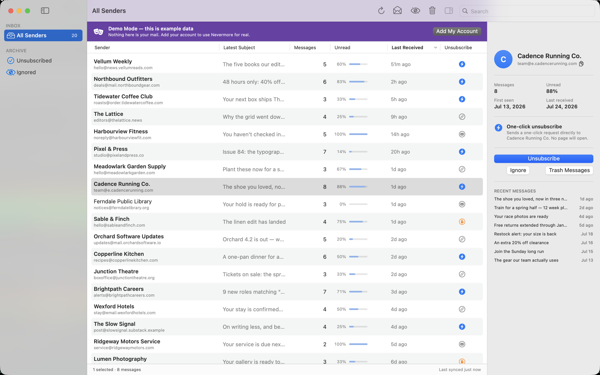
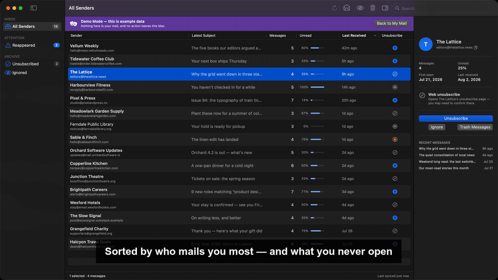
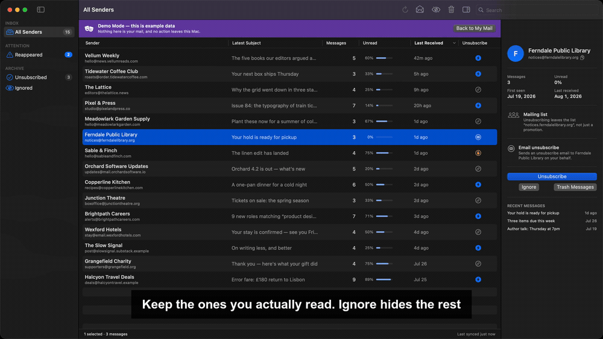
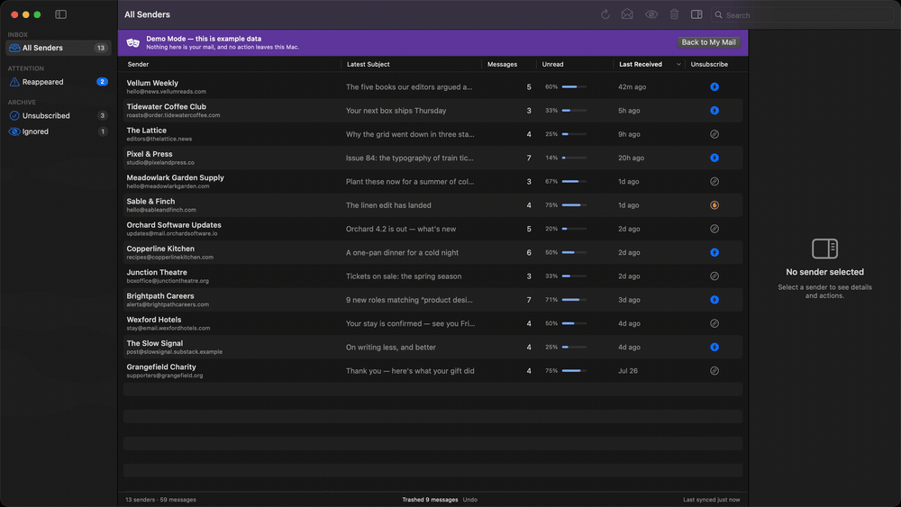
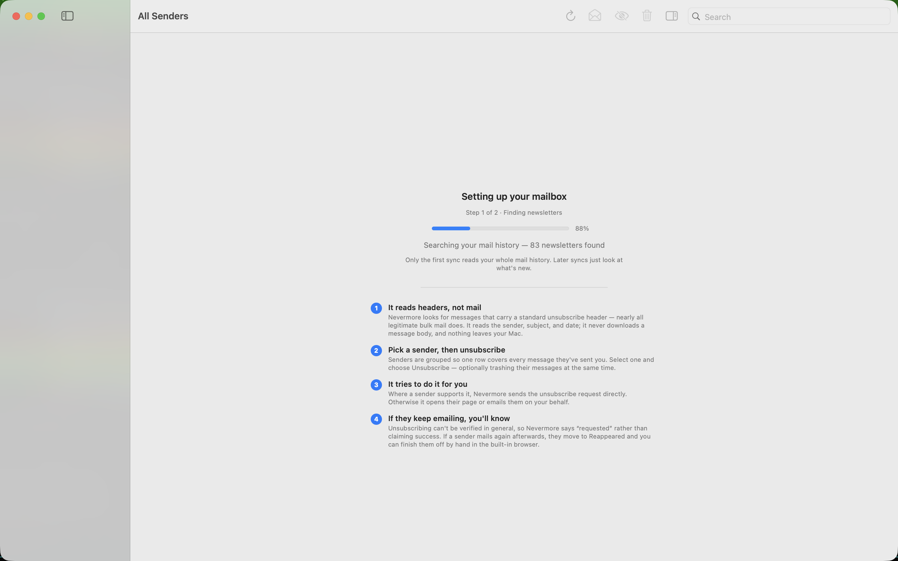
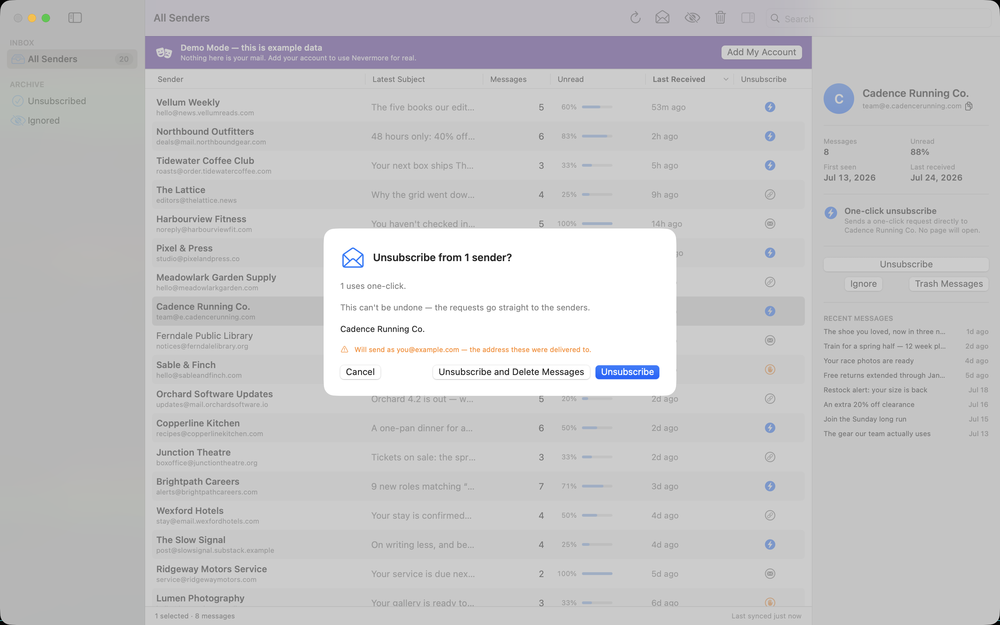
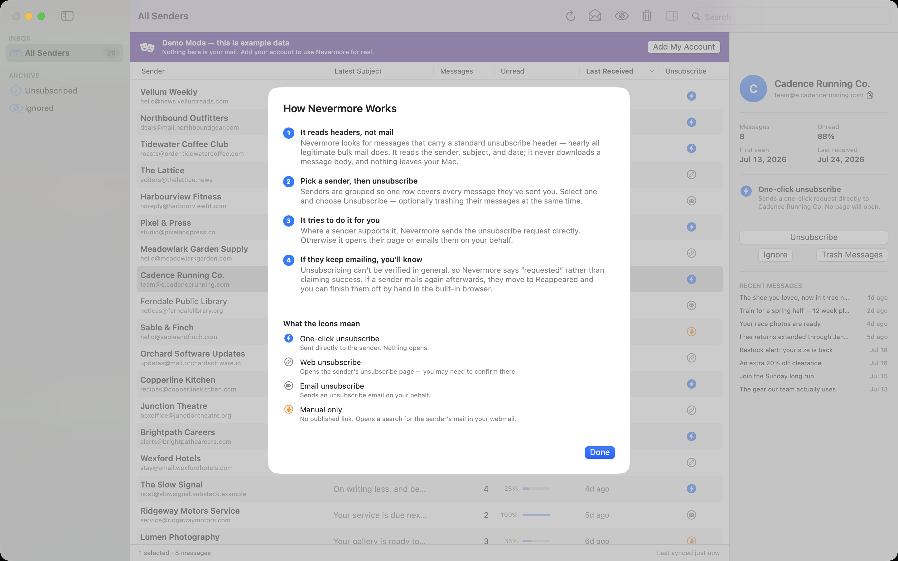

# Nevermore

A native macOS app for finding and bulk-unsubscribing from newsletters.

Nevermore syncs the *headers* of every message carrying a `List-Unsubscribe`
header into a local database, groups them by sender, and lets you unsubscribe
from or trash whole senders in a few keystrokes. It never downloads message
bodies, and it never sends your data anywhere except directly to the
unsubscribe endpoint the sender published.

The name is the point: senders that keep mailing after you unsubscribe get
flagged and shut down for good.

**[nevermore website](https://brooksc.github.io/Nevermore/)** ·
[download 1.0.0](https://github.com/brooksc/Nevermore/releases/latest) ·
[FAQ](https://brooksc.github.io/Nevermore/faq.html) ·
[privacy](PRIVACY.md)

> **Status:** 1.0.0 released for direct download; Mac App Store submission in review.
> Built and used daily against a real ~132,000-message mailbox.
> _Docs last reviewed: 9 August 2026._



<sup>All screenshots and recordings use Nevermore's built-in demo mailbox — the
senders are invented, which is why the app is showing its demo banner.</sup>

**[Watch the 30-second walkthrough](https://brooksc.github.io/Nevermore/#demo)**
— sync, unsubscribe, keep what you want, and catch the senders who carry on.

### One keystroke to unsubscribe

Pick a sender, press `u`. Nevermore sends the request the sender published, then
tells you what it actually did — "requested", not "unsubscribed", because an
endpoint returning success proves nothing.



### Keep what you want, clear out the rest

`i` ignores a sender for good; `⌘⌫` moves everything they've sent to your
provider's Trash, where you can still get it back.



### And it catches the ones that come back

This is the part a web service can't do. Senders who keep mailing after you
unsubscribed show up here with a count of what's arrived since — including the
ones that "confirmed" your request.



## Why another one of these

Most unsubscribe tools are web services that ask for OAuth access to your
mailbox and then read it on their servers. Unroll.me famously sold the results.
Nevermore is the opposite shape:

- **Local-first.** Everything runs on your Mac. There is no server, no account
  to create, and no telemetry. Your header cache is a SQLite file in
  Application Support; your password lives in the macOS Keychain.
- **Headers only.** It reads `From`, `Subject`, `Date`, `List-Unsubscribe`, and
  a few others. It never fetches a message body.
- **Honest about outcomes.** Unsubscribing is not verifiable in the general
  case. Nevermore distinguishes *requested* from *confirmed* rather than
  claiming success it can't prove — and it tells you when a sender ignores you.
- **No OAuth.** It signs in over plain IMAP with an app-specific password, so
  there's no Google Cloud project to create and no consent screen to click
  through.

## Features

- **Any IMAP provider.** Gmail, iCloud, Yahoo, Fastmail, and AOL are detected
  from your address; custom domains pick their provider. Folders are discovered
  at connect via the IMAP SPECIAL-USE extension rather than hard-coded.
- **Fast sync.** Header-only fetch runs at roughly 1,000 messages/second.
- **Smart grouping.** Senders are grouped by registrable domain (eTLD+1), with
  shared platforms split per newsletter so every Substack doesn't collapse into
  one row. You can override with *Split by Address* / *Keep as One Group*.
- **Full RFC 2369 / 8058 chain.** One-click `POST` where offered, then `GET`,
  then `mailto:`, then a built-in browser for senders that publish nothing
  usable.
- **Reappearance detection.** If a sender mails you again after a recorded
  unsubscribe, it surfaces in a dedicated collection with a notification.
- **Keyboard triage.** `j`/`k` to move, `u` unsubscribe, `⇧U` unsubscribe and
  delete without a confirmation, `v` open the newest message in your browser,
  `i` ignore, `d` trash, `?` for the full list. Every action advances to the
  next sender, so a mailbox can be cleared without touching the mouse.
- **Trash with undo.** Messages move to your provider's Trash and `⌘Z` puts
  them back.
- **Alias-aware.** Send-as addresses are inferred from your Sent folder, so
  `mailto:` unsubscribes go out from the address the mail was delivered to.
- **Multi-account**, with per-account databases.
- **Demo mode.** A built-in sample mailbox you can explore before handing over a
  password, and switch back to any time from Settings. It runs on a backend with
  no network code in it, so nothing in demo mode can reach a server.
- **Read-only MCP server.** Optional, off by default: let an AI agent read and
  classify your senders while you keep every action. See [Connecting an AI
  agent](#connecting-an-ai-agent-mcp).

## Screenshots

### First run

The first sync reads your whole mail history, so it explains itself while you
wait — and says which of the two steps it's on rather than leaving you guessing.



### Unsubscribing

Nevermore tells you what pressing the button will actually do — which senders
get a one-click request, which open a page, which get an email — before it does
it.



### What the icons mean

Available any time from **Help ▸ How Nevermore Works**, including an honest list
of what the app *won't* find.



## Install

Download the latest DMG from
[Releases](https://github.com/brooksc/Nevermore/releases/latest), open it, and
drag Nevermore to Applications. Signed and notarized by Apple.

## Requirements

- macOS 14 or later, Apple Silicon or Intel (universal binary)
- Xcode 26 (or matching Swift 6 toolchain) to build
- An app-specific password for your mail account

## Build

```bash
cd Packages/NevermoreKit
swift build                       # build everything
swift run nevermore-tests         # run the test suite (250 tests)
./make-app.sh release             # produce a signed Nevermore.app
./make-dmg.sh --notarize          # produce a notarized, stapled DMG
```

`make-app.sh` wraps the SwiftPM executable into a proper `.app` bundle. It
signs with the first Developer ID Application certificate it finds; set
`NEVERMORE_SIGN_IDENTITY` to choose one explicitly. Signing with a stable
identity matters — an ad-hoc signature changes every build, which invalidates
the Keychain ACL on the saved password.

To build with the App Sandbox enabled (as the Mac App Store requires):

```bash
NEVERMORE_SANDBOX=1 ./make-app.sh release
```

Note the sandbox relocates Application Support into the app container, so a
sandboxed build starts with no accounts. It also still embeds Sparkle — the
SwiftPM target links it unconditionally, so the framework has to be there for
the app to launch at all. Only the Tuist store target genuinely omits the
updater. See [MAS-RELEASE.md](MAS-RELEASE.md).

## Setup

Not ready to hand over a password? The first screen offers **Try the Demo** — a
sample mailbox with no account required. Settings ▸ Advanced switches back and
forth later.

1. Turn on two-factor authentication for your mail account.
2. Create an app-specific password (Nevermore links you to the right page for
   your provider).
3. Enter your address and that password. It goes straight to the Keychain.

macOS will ask permission the first time Nevermore reads its own Keychain item.
Choose **Always Allow** so it stops asking.

## Architecture

```
Packages/NevermoreKit/
├── Sources/
│   ├── NevermoreKit/          # no SwiftUI — domain logic, testable headless
│   │   ├── Domain/            # value types + pure logic, zero I/O
│   │   ├── Backend/           # MailBackend protocol, IMAP implementation
│   │   ├── Unsubscribe/       # RFC 2369/8058 engine, SSRF destination guard
│   │   ├── Store/             # GRDB/SQLite header cache
│   │   ├── Demo/              # fabricated mailbox + a backend with no network
│   │   └── Credentials/       # Keychain, account registry
│   │   └── Server/            # loopback HTTP server + the read-only MCP surface
│   ├── NevermoreApp/          # SwiftUI app: views, sheets, AppModel
│   ├── NevermoreMCP/          # nevermore-mcp: stdio->HTTP bridge for MCP clients
│   └── Probe/                 # CLI harness for live-mailbox testing
└── Tests/NevermoreTests/
```

`NevermoreKit` must not import SwiftUI — the domain logic stays testable
without launching a UI.

Release process and versioning: [RELEASE.md](RELEASE.md). Mac App Store
specifics: [MAS-RELEASE.md](MAS-RELEASE.md).

Design documents: [PLAN.md](PLAN.md) for architecture decisions and
[UI_SPEC.md](UI_SPEC.md) for the interface brief. Both are design-time
snapshots and have drifted from the code in places; this README and the source
are authoritative.

## Security

The app acts on data written by strangers — a `List-Unsubscribe` header is
attacker-authored input that drives outbound network requests and email. It's
built accordingly:

- **SSRF guard.** Unsubscribe URLs are resolved and rejected unless they point
  at a public, global-unicast address, so a sender can't aim a request at
  `localhost`, your LAN, or a cloud metadata endpoint. Redirects are
  re-validated at every hop.
- **Header-injection defense.** `mailto:` values are percent-decoded, so
  control characters are stripped and the subject is RFC 2047-encoded
  unconditionally; recipients must be a single well-formed address.
- **STARTTLS required** when sending, so a stripped capability can't downgrade
  the session and leak your password in cleartext.
- **Device-bound credential.** The app password is stored
  `WhenUnlockedThisDeviceOnly`, so it can't ride a backup to another machine.
- **Every sender-supplied URL is guarded** — the silent request, the redirect
  chain, the in-app browser, and the "Manage" link in your unsubscribe history.

## Connecting an AI agent (MCP)

Nevermore decides one sender at a time, which is the right shape when the answer
is uncertain and useless when the question is *"which of these 400 senders
belong to a life situation that is now over"*. That judgement is semantic and
changes over time. Rather than build an LLM into a mail app, Nevermore can hand
a **read-only** view of your senders to an agent you already use, and keep the
acting to itself.

**Read this first: subject lines leave your Mac.** The agent sees sender names,
addresses, domains, subject lines, dates and read rates — and sends them to
whatever model it runs, which is usually cloud-hosted and run by someone else.
Message *bodies* are never available, because Nevermore never downloads them.
This is the one thing the app does that isn't local, it is off until you turn it
on, and [PRIVACY.md](PRIVACY.md#connecting-an-ai-agent-mcp) spells out the rest.

### Setting it up

1. Build the bridge: `cd Packages/NevermoreKit && swift build -c release`. The
   binary lands at `.build/release/nevermore-mcp`. It ships with the direct
   download only — the Mac App Store build does not contain it.
2. In Nevermore, open **Settings ▸ Local Server** and turn the local server on.
3. Point your MCP client at the binary. For Claude Code:

   ```bash
   claude mcp add nevermore /full/path/to/nevermore-mcp
   ```

   or, for a client that reads a JSON config:

   ```json
   {
     "mcpServers": {
       "nevermore": { "command": "/full/path/to/nevermore-mcp" }
     }
   }
   ```

**Nevermore has to be running, with the local server on, whenever the agent
calls a tool.** The bridge holds no mail of its own — it forwards to the app,
which is the only thing that opens the database. If the app is closed, the
tools report that rather than answering from a cache. It survives the app being
quit and relaunched underneath it, so you do not need to restart your MCP client
when you restart Nevermore.

### What the agent gets

Nine read tools: `mailbox_summary` and `sync_status` for orientation,
`list_senders` (filtered by collection, message count, read rate, recency,
unsubscribe method, mailing-list status, or a recorded classification),
`search_senders`, `get_sender`, `list_messages`, `unsubscribe_history`,
`list_reappeared`, and `list_by_context`.

Senders are partitioned by **how** they can be unsubscribed from — one-click
POST, plain link, `mailto:`, or nothing machine-readable — which is known from
the stored headers, so an agent can tell you which senders will need a browser
without attempting anything.

### What it can't do

- **It cannot act.** There is no unsubscribe, ignore or trash tool. Bulk action
  goes through a selection you review and confirm in the app.
- **It cannot switch accounts.** Only the account currently open is served, and
  every response names it.
- **It refuses in demo mode**, so an agent can't spend a context window
  reasoning about a fabricated mailbox.
- **It cannot read your mail.** The bodies are not there to read.

## Your mail

Nevermore **never permanently deletes anything**. "Trash" moves messages to your
provider's Trash folder, where they sit under that provider's own retention
(30 days on Gmail) and can be restored by you at any time. The app never issues
an IMAP `EXPUNGE`. Small batches also offer an in-app undo with ⌘Z.

The local database is a cache of headers. Deleting it loses your unsubscribe
history and ignore list, not mail.

Found something? Open an issue — or email if it's sensitive.

## Licence

**Personal use, source-available.** You may read, audit, build, and run
Nevermore for your own personal use, and modify it privately. You may not
redistribute it, publish a fork, or use it commercially. See
[LICENSE](LICENSE).

The source is published because an app that reads your mail and holds a
credential to it should be inspectable. That's a different thing from open
source, and this licence says so plainly.

## Privacy

No servers, no accounts, no telemetry. See [PRIVACY.md](PRIVACY.md).
